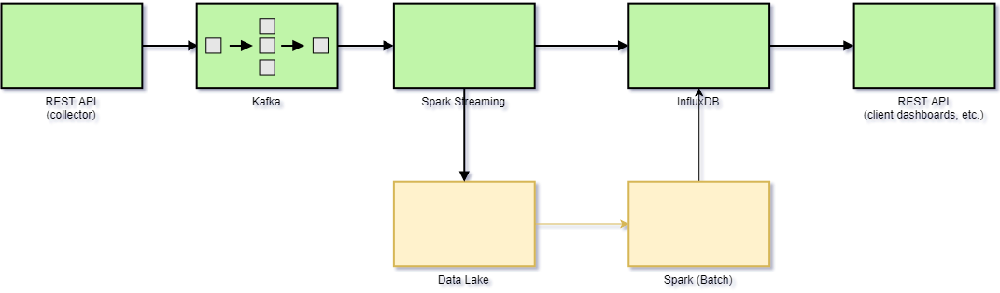

#Architecture

The above diagram shows various components and how they're integrated to achieve the high level requirements 
for the system. 

## Considerations

The important feature of the design behind this system is that each component is loosely coupled with others. For example, the REST API layer that's taking the event information from the websites, should not know anything about how those events are going to be processed. Across the architecture, it's important to define canonical message schemas, and each component will be responsible for doing any custom transformations.

The hosting infrastructure is the other important consideration. We will take advantage of containerization to abstract the code behind APIs from the infrastructure. This will allow us to dynamically scale APIs as the volume grows/shrinks, and provide a more robust deployment architecture to be able to hotfix any issues with minimal downtime. 

Below explains various components and rationale behind the technology stack.

###REST API (collector)

This will be the API that the JavaScript component included on web pages that require Google Analytics calls to send the events (e.g. page loads, user browser / IP information, click events, mouse events, etc.).
Since we are only focusing on the backend, we will not discuss the JavaScript library.

The API will be written in Java Spring, and will be responsible for accepting events from the clients, and sending the information to a Kafka topic.

The API will be hosted in Docker on a Kubernetes cluster running in a cloud provider (e.g. AWS, Azure, GCP, etc.). We can use Ingress to expose the HTTP routes to the service layer in the Kubernetes cluster and use it as a loadbalancer (e.g. round-robin, or another algorithm).

### Kafka

The events will be published to a particular Kafka topic by the API layer discussed previously. Kafka will be hosted as a cluster
and have a configurable retention of messages (we can set SLA of 1 day to store events in a Kafka cluster to mitigate the risk of downstream components failing, and needing to be brought up and events processed from Kafka). The messages in Kafka
will have a defined standard schema in JSON format, which the API discussed previously will publish to Kafka.

Kafka is a good choice for storing events in a queue because it's highly scalable, immutable, and guarantees transaction consistency of the events. In case the downstream systems have an outage, Kafka
will be able to queue up the events for later processing.

### Spark Streaming

Apache Spark will be reading the stream of messages from Kafka topic and doing aggregations. For example, we will want to aggregate
certain metrics by dimensions such as geography, language, browser type, etc. at some lowest granularity of time (e.g. minutes). This will allow a user to
 see how many unique users visited their website every minute of the day from different countries, using certain browsers, etc. 
 
 Spark is a parallel processing engine that is optimized for these types of map-reduce operations.
 
 ### Data Lake
 
In addition to aggregating raw events, Spark will also be appending the raw events for archival storage in a data lake (e.g. AWS S3). We can use a columnstore format, such as parquet, to optimize doing batch
aggregations on the raw events data. This is necessary in case we had bugs in our processing logic in the streaming component of Spark, and need to re-process the data in batch.

### Spark (Batch)

This components shares the processing code in Spark Streaming. However, instead of reading data from the Kafka stream into the data frames, the ingestion code in Spark will be reading
from a parquet file stores in S3. The important note here is that the events processing / aggregation code will be the same as in Spark Streaming component.

### InfluxDB

Since most queries will be time-series related (e.g. aggregate events by minutes/hours/days/months/etc.), we will need to use a database that's optimized for time series. InfluxDB is a good candidate, because it's optimized for time series analytics, and it can be hosted in a cluster (vertically/horizontally scalable).

Important note here is that InfluxDB will not be storing the raw events data. Instead, it will get its data from the Spark Streaming or Spark Batch component, which already does some minimal aggregations at a reasonable granularity in time (e.g. by minute).

### REST API (client dashboards, etc.)

Similarly to the REST API (collector) component, this component will have the same hosting infrastructure. It will take requests from the clients (e.g. dashboards, or some custom-written code by a client), send a time-series analytic query to InfluxDB cluster, and then return the results.